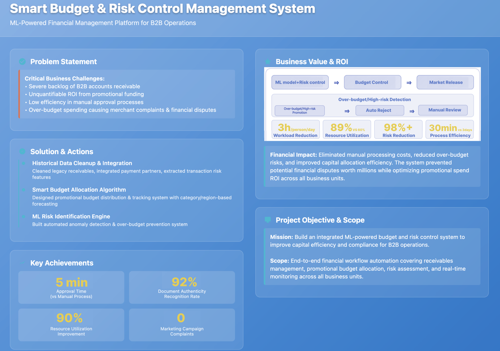

### **Background**

There was a serious backlog of B2B accounts receivable. The ROI of promotional funds was difficult to quantify, and manual auditing and deployment processes were inefficient. These issues led to over-budget campaigns, triggering complaints from distributors and financial disputes.

### **Objective**
Develop an integrated budgeting and risk control system embedded with a machine learning (ML) scoring model to improve fund utilization efficiency and compliance.

### **Actions**
- Cleared historical receivables and introduced third-party payment partners. Extracted transaction risk features and embedded them into the approval process.
- Designed a promotional budget allocation algorithm and a tracking mechanism to support year-round, category- and region-specific budget planning, enabling data-driven ROI optimization.
- Built a risk identification mechanism using ML models to automatically flag abnormal activities and block over-budget deployments, eliminating the risk of financial waste.

### **Results**
- Approval efficiency improved from manual review to automatic processing within 5 minutes, with a 92% accuracy rate in document authenticity verification.
- Resource utilization rate reached 90%, with zero complaints from marketing campaigns, enabling precise risk control and fund allocation across departments.

# elaine
