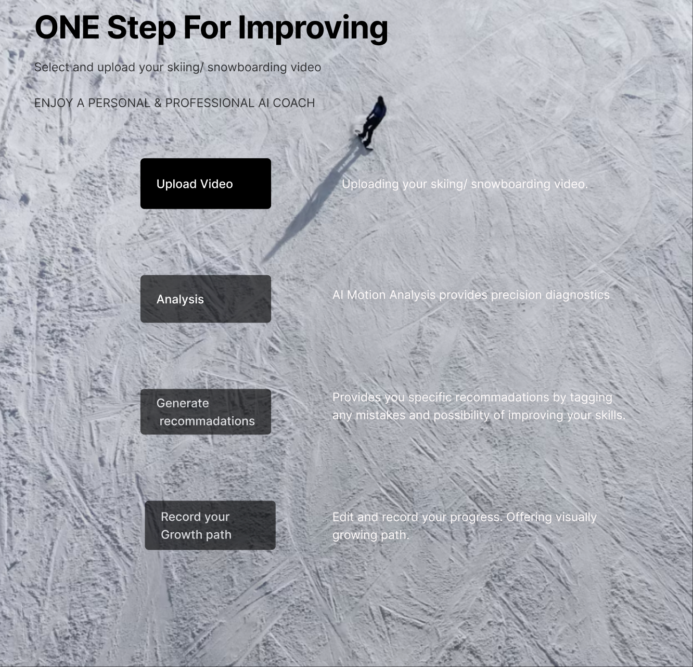
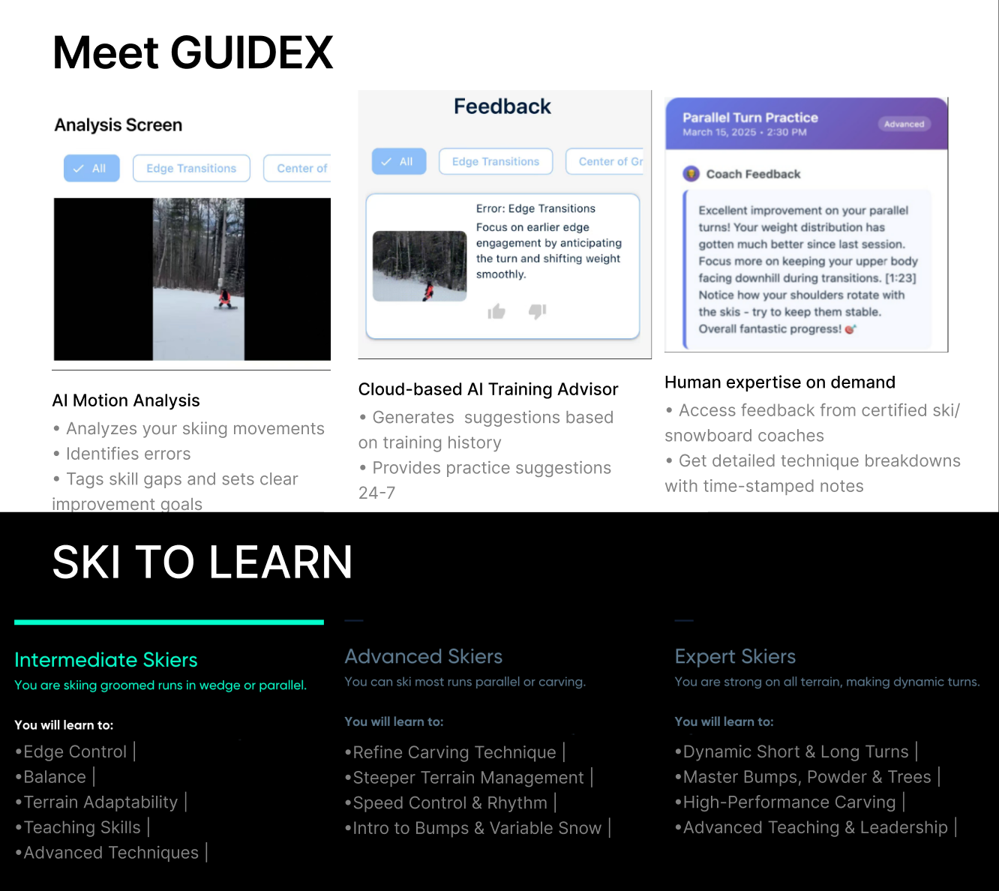
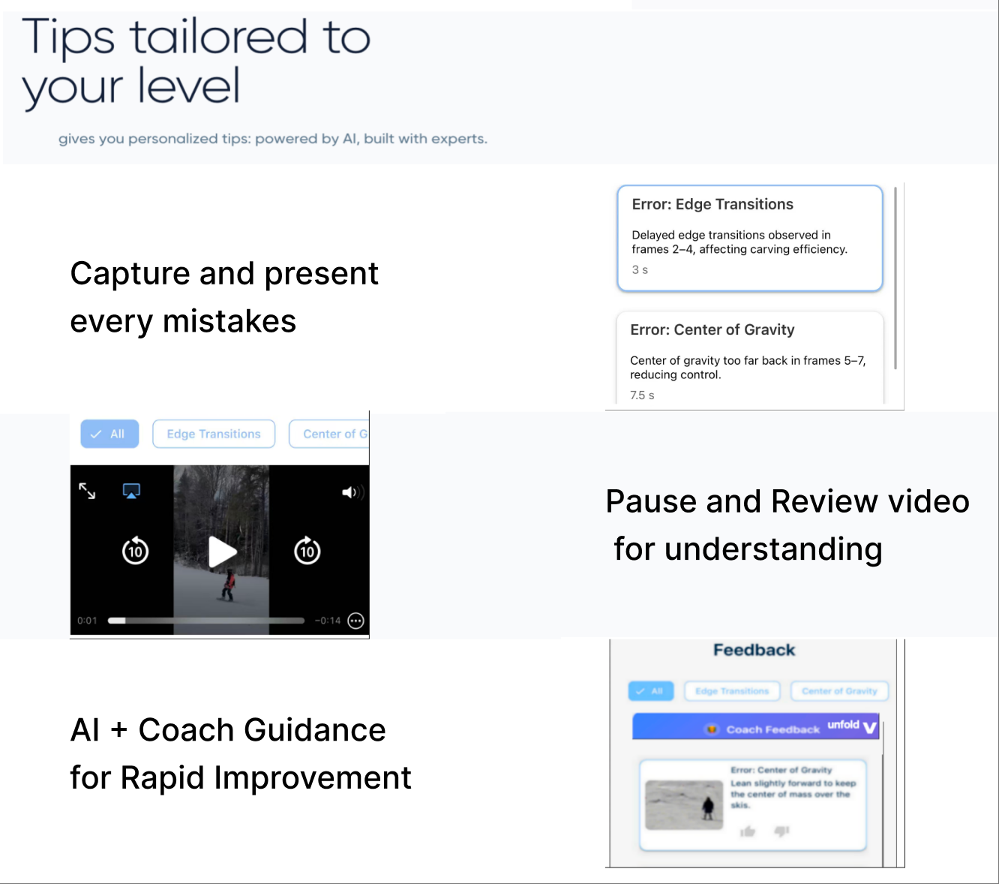
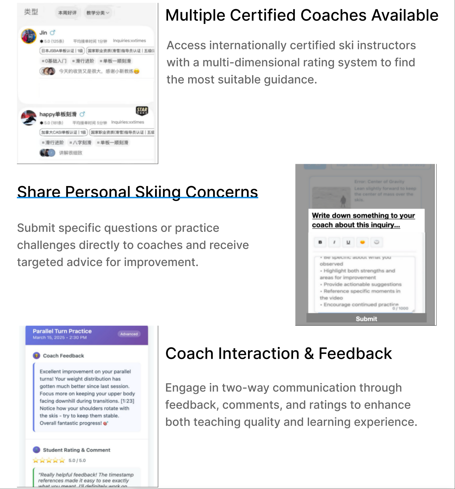

### **Background**

Beginner snowboarders lack affordable and real-time coaching solutions. Traditional instructors are expensive, require advance booking, and cannot deliver instant feedback aligned with standardized training methods.

### **Objective**
Develop an AI-powered coaching app that analyzes user-uploaded ski videos, detects incorrect movements based on international CASI/CISA/AASI/BASI/JSBA standards, and delivers beginner-friendly, actionable improvement guidance.

### **Actions**
- Led end-to-end product lifecycle from requirement analysis to feature design, MLOps deployment, and launch of dual apps for users and coaches.

- Defined video data standards and collaborated with engineering teams to implement time-series deep learning models for motion recognition and error detection.

- Structured CASI/CISA standards into explainable feedback modules, enabling interpretable guidance that addressed beginner cognitive pain points.

- Designed scalable product architecture (personalized feedback for users + data management for coaches) and implemented a closed-loop feedback mechanism to enhance model performance and business value.

### **Results**
- Successfully launched the first AI-based snowboard edge-switching guidance product with 70% model accuracy.

- Reduced user effort in motion comprehension by 90% and shortened learning cycles by 1–2 weeks.

- Pioneered a low-cost AI virtual coaching model, setting a new benchmark for scalable sports technology applications.

# elaine
