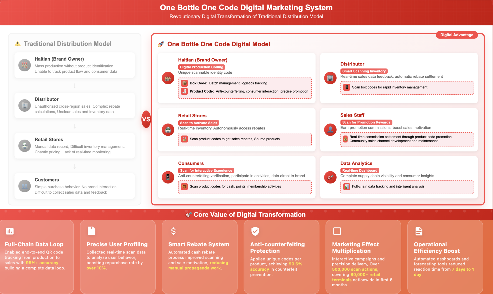

### Background
Traditional terminal marketing lacked clear touchpoints and user behavior data, resulting in inefficient advertising spend and poor targeting. The project had been stagnant for years.

### Objective
Leverage a "one bottle, one code" campaign combined with terminal promotion to enable precise, multi-regional deployment. The goal was to increase GMV and repurchase rates, improve terminal data visualization, and enable user journey tracking and repurchase modeling.

### Actions
1. **Led the marketing-side product management** of the "One Product, One Code" system development and deployment. Designed business logic and interaction flow, and coordinated cross-functional teams including Production, IT, Branding, Legal, and Warehousing to build the traceable code platform.
2. **Co-developed the data collection system** with the engineering team to capture scan activity, defined behavioral indicators based on user traits, and designed backend modules for behavior analytics, lottery draw system, rewards store, real-time dashboards, and fraud risk controls.
3. **Achieved over 500,000 code scans** within 6 months post-launch, covering 80,000+ retail locations nationwide. Successfully broke through traditional distribution system data silos and enabled repurchase prediction models, enhancing flexible marketing strategies by region.

### Results
- Significantly improved user insight coverage.
- Achieved 90% accuracy in data path analysis.
- Delivered high-quality data input to support scaled distributor management, GMV growth on the consumer side, and company-wide digital transformation.
- First company in the seasoning industry to successfully implement and go live with a product-code traceability platform.

# elaine