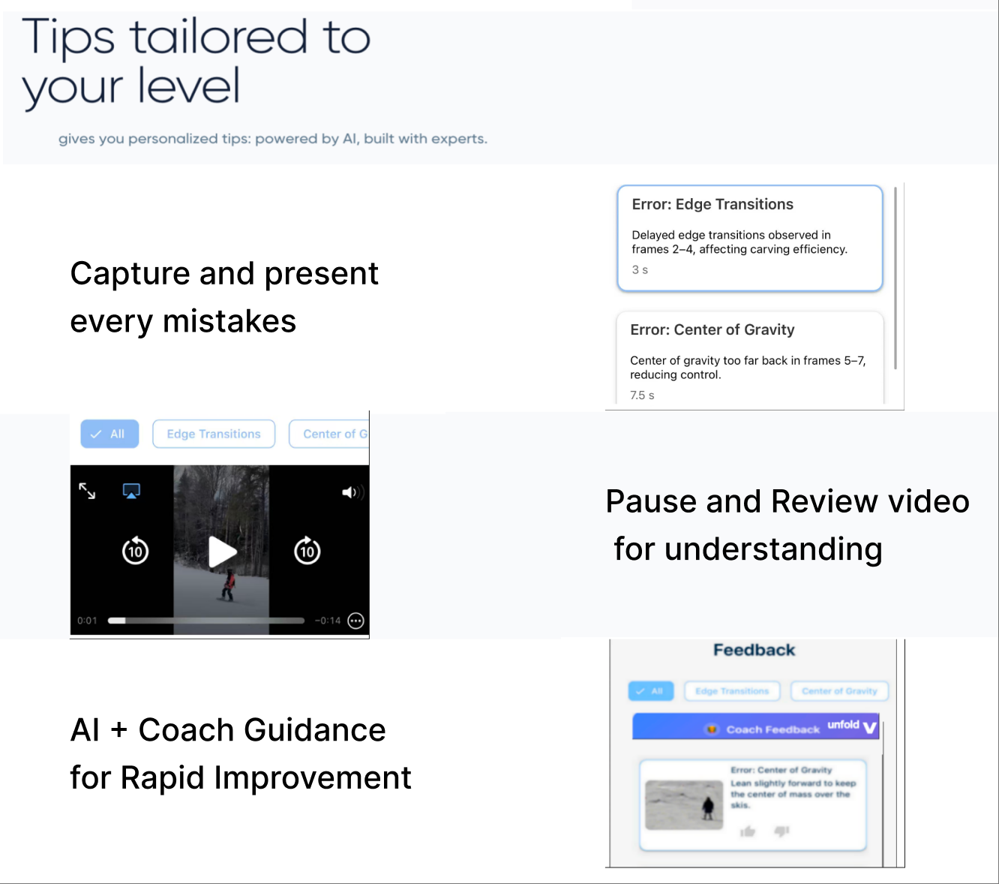

### **Background**

>Beginner snowboarders lack affordable and real-time coaching solutions. Traditional instructors are expensive, require advance booking, and cannot deliver instant feedback aligned with standardized training methods.

# **Why do this**
>As a skiing enthusiast, I experienced the pain points of traditional coaching: high costs, uneven quality, long booking cycles, and feedback that was often too technical for beginners. Many learners, especially at the transition stage, need real-time, simple guidance before bad habits become ingrained—something appointment-based coaches cannot provide.  
To address this gap, I envisioned an AI coaching system that offers immediate, easy-to-understand feedback through video analysis. By making expert-level guidance more accessible, affordable, and scalable, the product lowers barriers for beginners and opens new opportunities for the ski training market.

# **Actions**
>1. **Identified unmet user needs** Conducted user interviews and market research to validate pain points in traditional coaching (high cost, inconsistent quality, lack of real-time feedback).  
>2. **Defined product vision and roadmap** Wrote PRD specifying MVP features, learning flows, and monetization strategies (membership + coach marketplace).  
>3. **Built training dataset** Coordinated large-scale collection and labeling of skiing/snowboarding videos, aligning annotations with CASI/CISA/AASI/BASI/JSBA  professional standards for model training.  
>4. **Bridged product and engineering**  Worked closely with developers to translate user scenarios into functional requirements, ensuring AI analysis and feedback aligned with user needs and business goals.  
>5. **Tested and iterated post-development** Oversaw beta testing with early users and coaches, measured model accuracy and usability, and refined features to improve adoption and scalability. 

### **Results**
>- Successfully launched the first AI-based snowboard edge-switching guidance product with 70% model accuracy.  
>- Reduced user effort in motion comprehension by 90% and shortened learning cycles by 1–2 weeks.  
>- Pioneered a low-cost AI virtual coaching model, setting a new benchmark for scalable sports technology applications.
