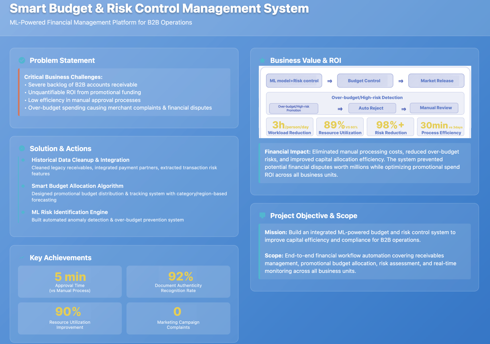

# Background
>There was a serious backlog of B2B accounts receivable. The ROI of promotional funds was difficult to quantify, and manual auditing and deployment processes were inefficient. These issues led to over-budget campaigns, triggering complaints from distributors and financial disputes in the previous CRM system.  

# Why do this

>1. **Process Digitization**  Move budgeting, approval, and deployment online for easier operation, management, and record-keeping.  
>2. **Automatic Budget Monitoring**  Real-time comparison of campaign intensity versus budget limits to prevent overspending..  
>3. **Management Visibility**  Provide clear dashboards with actionable insights, serving as a critical tool for independent regional marketing operations.  
>4. **Cost and Time Efficiency**  Reduce manual review time and costs while avoiding human error or bias in approval processes.  

# Actions
>1. **Receivables and Payment**  Integration Cleared historical receivables, introduced third-party payment platforms, and built a transaction risk feature library embedded into the approval workflow to enhance fund security and compliance.  
>2. **Smart Budget Allocation**  Designed a promotional budget allocation algorithm and tracking mechanism to support year-round, category-based, and region-specific planning, enabling data-driven ROI optimization.  

3. **Automated Risk**  Control Developed a machine learning–based risk identification system to automatically detect and block abnormal budget usage, preventing overspending and financial waste.  
4. **Dashboard and Insights**  Built a real-time management dashboard to track budget execution, campaign ROI, and risk alerts, empowering regional marketing teams with independent operations and smarter decision-making. 

# Results
>- Approval efficiency improved from manual review to automatic processing within 5 minutes, with a 92% accuracy rate in document authenticity verification.  
>- Resource utilization rate reached 90%, with zero complaints from marketing campaigns, enabling precise risk control and fund allocation across departments.  

