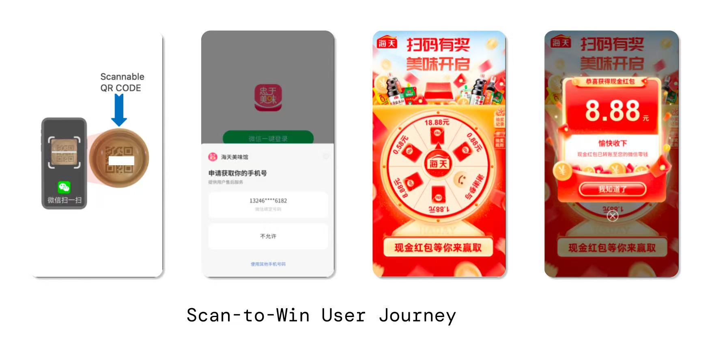
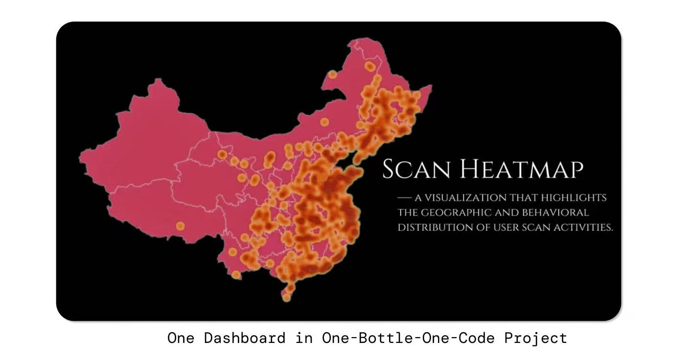
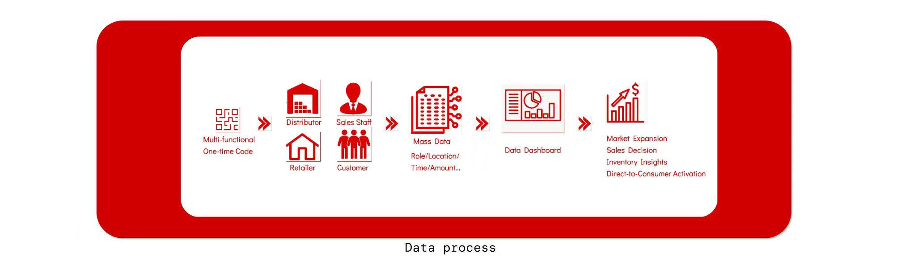
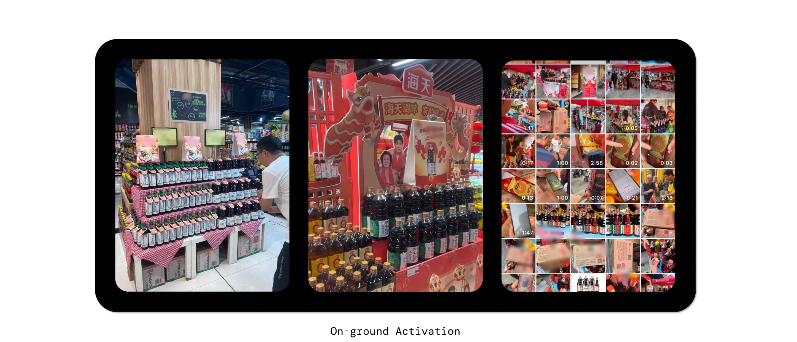
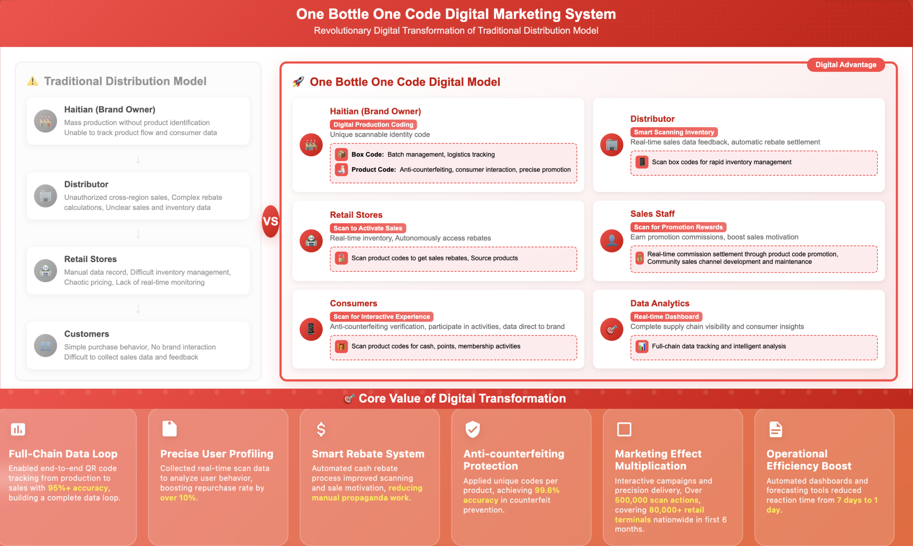

# Background

>Traditional terminal marketing lacked clear touchpoints and user behavior data, resulting in inefficient advertising spend and poor targeting. The project had been stagnant for years. 

# Why Do This

>1. **Market Trend Alignment** Leading brands are already running QR code campaigns, proving both feasibility and strong momentum.  
>2. **Boost New Product Penetration** QR code scans capture coverage data and consumer insights, helping identify potential markets and accelerate new product adoption.  
>3. **Leverage Real-Time Data** Gain valuable supply chain visibility and verify product coverage by analyzing QR code data.  
>4. **Access Inventory Insights** Track channel inventory and product shelf life to optimize sales strategies and market adjustments.  
>5. **Strengthen the Value Chain & Drive Sales** Resource investment ensures more precise promotions, faster sell-through, and consumer engagement via instant rewards and gamified incentives. 
  

# Actions

>1. **End-to-End QR Code Design**  Led the full design of the QR code system, covering production line integration, material/size specifications, and accuracy testing. Established unified scanning standards to ensure high reliability across the supply chain.  
>2. **Lottery  Membership System Integration** Designed the scan-to-win user journey interface and aligned it with two branded WeChat mini-programs, enabling membership data consolidation for maximum utilization while ensuring a seamless user experience.

  
  
>3. **Dashboard and Risk Control Framework** Design the multifunctional dashboard for  data monitoring. Built and implemented over 500 real-time monitoring rules to detect abnormal scan behavior and prevent fraudulent activities, closing system loopholes.

  
  
>4. **Marketing & Communication Standards** Oversaw campaign communication, including the design of standardized promotional materials and nationwide SOPs for the sales team, ensuring consistent product display and retail execution.  
>5. **System Testing & National Launch** Directed full testing and rollout of the QR code system, and designed the “Light Salt Gold Rush” nationwide campaign, leveraging the Light Soy Sauce line to promote both the product and the digital system nationwide.

# Results  
>- Successfully launched the first traceable QR code platform in the seasoning industry, achieving 90% accuracy in data path analysis and providing high-quality inputs for distributor management and nationwide GMV growth.  
>- Co-developed the backend modules including lottery system, rewards store, and membership data merge. Significantly improved user insight coverage and enabled precise, personalized marketing campaigns.  
>- Designed and deployed real-time monitoring rules, effectively preventing fraudulent scans and ensuring data integrity across 80,000+ retail terminals.  
>- Applied the QR code system to new campaign models, shifting promotions from traditional methods to scan-to-rebate at consumer and terminal levels. This drove rapid adoption and contributed directly to sales growth.  
>- Achieved over 500,000 code scans in the first 6 months across 80,000+ retail locations. The Light Soy Sauce “Gold Rush” campaign alone generated ¥18.82M revenue in just 2 months, a 234% YoY increase, proving the effectiveness of the system and accelerating company-wide digital transformation.

