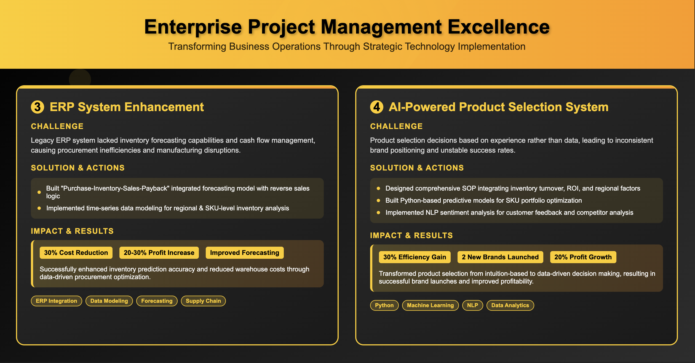

### Background
The original ERP system could not support accurate inventory forecasting or manage the cash flow cycle, leading to overstock and chaotic procurement rhythms. The manufacturing factories were unable to manage operations effectively.

### Objective
Develop an ERP forecasting system that incorporates "payment cycle" logic to enable synchronized management of demand, sales, and capital flow.

### Actions
- Built a linked model for "Procurement–Warehousing–Sales–Payment Collection" and integrated it into the ERP system for rolling annual budget forecasting.
- Modeled inventory turnover using time-series data at both regional and SKU levels to identify redundant stock.

### Results
- Improved inventory forecasting accuracy.
- Reduced warehousing costs by 30%.
- Controlled product profit margins between 20–30%.

---

### **AI-Powered Product Selection and Brand Incubation System**

### Background
Product selection decisions were based on subjective judgment, and brand incubation lacked data support, resulting in inconsistent efficiency and success rates.

### Objective
Establish a data-driven product selection system and utilize AI to assist in new product entry and brand positioning.

### Actions
- Designed a product selection SOP incorporating multi-factor scoring models using warehousing turnover rate, ROI, and regional demand heat.
- Built a popularity prediction model using Python to assist with SKU mix optimization.
- Developed an NLP-based sentiment analysis model to interpret user reviews and differentiate competitors, aiding OEM strategy.

### Results
- Improved product selection efficiency by 30%.
- Successfully launched 2 self-developed brands.
- Achieved 20% profit margin on individual SKUs.

